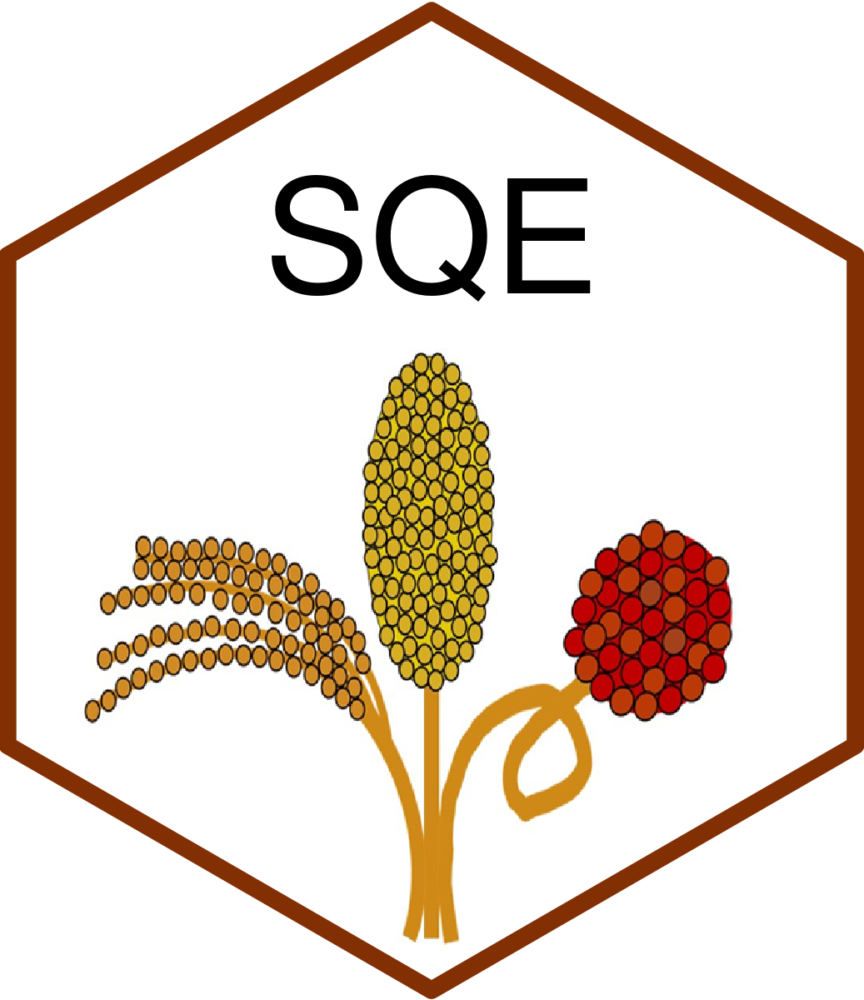

SQE: Sorghum QTL effects estimated in different multi-environment sorghum experiments - Beta version.
====

<p align="center">
  
</p>

## Overview

This application allow the user to search for QTL on sorghum trait in the results from several sorghum experiments realized using different BCNAM populations in multiple environments.

## Installation

In R console:

```
devtools::install_github("vincentgarin/SQE")

```

## Usage


```

library(SQE)

run_app()

```
